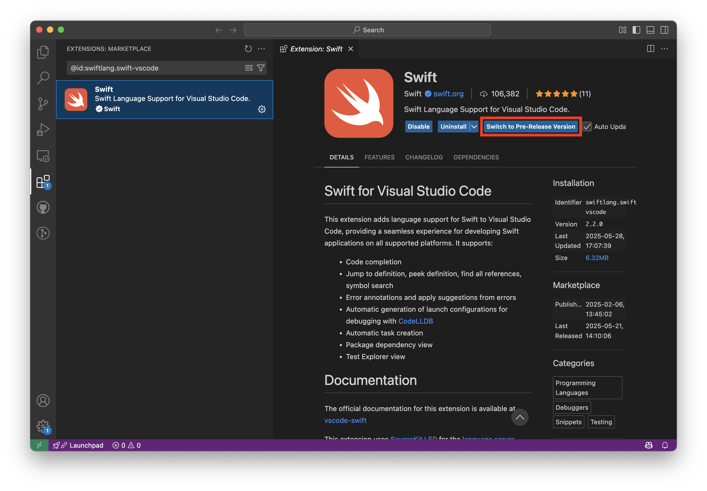

# Welcome to the Swift Community!

Contributions to vscode-swift are welcomed and encouraged! Please see the [Contributing to Swift guide](https://www.swift.org/contributing/) and check out the [structure of the community](https://www.swift.org/community/#community-structure).

To be a truly great community, Swift needs to welcome developers from all walks of life, with different backgrounds, and with a wide range of experience. A diverse and friendly community will have more great ideas, more unique perspectives, and produce more great code. We will work diligently to make the Swift community welcoming to everyone.

To give clarity of what is expected of our members, Swift has adopted the code of conduct defined by the Contributor Covenant. This document is used across many open source communities, and we think it articulates our values well. For more, see the [Code of Conduct](https://www.swift.org/code-of-conduct/).

# Contributing to /vscode-swift

## Development

To begin development on the VS Code extension for Swift you will need to install [Node.js](https://nodejs.org). We use [nvm](https://github.com/nvm-sh/nvm) the Node version manager to install Node.js. To install or update nvm you should run their install script
```sh
curl -o- https://raw.githubusercontent.com/nvm-sh/nvm/v0.40.3/install.sh | bash
```
More details on nvm installation can be found in the [README](https://github.com/nvm-sh/nvm/?tab=readme-ov-file) from its GitHub repository.

Once you have installed nvm, you can clone and configure the repository.

```sh
git clone https://github.com/swiftlang/vscode-swift.git && cd vscode-swift
```

Install the correct version of Node.JS for developing the extension

```sh
nvm install
```

Installs all the dependencies the extension requires

```sh
npm install
```

When you first open the project in VS Code you will be recommended to also install [`ESLint`](https://marketplace.visualstudio.com/items?itemName=dbaeumer.vscode-eslint) and [`Prettier - Code formatter`](https://marketplace.visualstudio.com/items?itemName=esbenp.prettier-vscode). Please do so. `ESLint`, `Prettier - Code formatter` is used to ensure a consistent style and we expect everyone who contributes to follow this style as well.

To run your version of the Swift extension while in VS Code, press `F5`. This will open up another instance of VS Code with it running. You can use the original version of VS Code to debug it.

### Installing Pre-Release Builds

If you'd like to try out a change during your day to day work that has not yet been released to the VS Code Marketplace you can build and install your own `.vsix` package from this repository.

#### Building

If you haven't already, follow the instructions in [Development](#development) to clone the repository and install its dependencies. Now we can generate the `.vsix` package:

```sh
npm run dev-package
```

This builds a file that looks like `swift-vscode-[version]-dev.vsix`. Now install the extension with:

```sh
code --install-extension swift-vscode-[version]-dev.vsix
```

Alternatively you can install the extension from the Extensions panel by clicking the `...` button at the top of the panel and choosing `Install from VSIX...`.

If you'd like to return to using the released version of the extension you can uninstall then reinstall Swift for VS Code from the Extensions panel.

#### Pre-Release Builds on the Marketplace

Occasionally, pre-release builds will be published to the VS Code Marketplace. You can switch to the pre-release version by clicking on the `Switch to Pre-Release Version` button in the Extensions View:



Switching back to the release version can be done by clicking on the `Switch to Release Version` button.

Release builds for the extension will always have an even minor version number (e.g. `2.0.2`). Pre-release versions will always be one minor version above the latest release version with a patch version set to the day that the VSIX was built (e.g. `2.1.20250327`). These rules are enforced by CI.

The version number in the [package.json](package.json) should always match the most recently published build on the VS Code Marketplace.

## Submitting a bug or issue

Please ensure to include the following in your bug report:
- A concise description of the issue, what happened and what you expected.
- Simple reproduction steps
- Version of the extension you are using
- Contextual information (Platform, Swift version etc)

## Submitting a Pull Request

Please ensure to include the following in your Pull Request (PR):
- A description of what you are trying to do. What the PR provides to the library, additional functionality, fixing a bug etc
- A description of the code changes
- Documentation on how these changes are being tested
- Additional tests to show your code working and to ensure future changes don't break your code.

Please keep your PRs to a minimal number of changes. If a PR is large, try to split it up into smaller PRs. Don't move code around unnecessarily as it makes comparing old with new very hard. If you have plans for a large change please talk to the maintainers of the project beforehand either on the [swift.org forums](https://forums.swift.org) in the [VS Code Swift Extension category](https://forums.swift.org/c/related-projects/vscode-swift-extension/) or in the `#vscode-swift` channel on the Swift Server Slack. You can [join the Slack workspace here](https://join.slack.com/t/swift-open-source/shared_invite/zt-1a3hxb9r5-8sFU3D7JUvaP5QO1AjSivg).

### Testing

> [!NOTE]
> For a detailed guide on how to write tests for the VS Code Swift extension, see [the guide about writing tests for the VS Code Swift extension](docs/contributor/writing-tests-for-vscode-swift.md).

Where possible any new feature should have tests that go along with it, to ensure it works and will continue to work in the future. When a PR is submitted one of the prerequisites for it to be merged is that all tests pass.

For information on levels of testing done in this extension, see the [test strategy](docs/contributor/test-strategy.md).

To get started running tests first import the `testing-debug.code-profile` VS Code profile used by the tests. Run the `> Profiles: Import Profile...` command then `Select File` and pick `./.vscode/testing-debug.code-profile`.

Now you can run tests locally using either of the following methods:

- From VS Code, by selecting `Extension Tests` in the Run and Debug activity.
- Using `npm run test` from your terminal
  - You can also use `npm run unit-test` or `npm run integration-test` to specifically run the Unit Tests or Integration Tests respectively.

Tests can also be launched from the terminal with the `--coverage` flag to display coverage information. For example:

```bash
npm run unit-test -- --coverage
```

### Extension API Versioning

The Swift extension exposes a public API to other extensions as defined in [`src/SwiftExtensionApi.ts`](src/SwiftExtensionApi.ts). This API follows [semantic versioning](https://semver.org/) and is separate from the extension's version number.

When making changes to the public API you must update the `"api-version"` property in the `package.json`. The following sections describe when each version number should be updated:

#### MAJOR version (breaking changes)
Increment when making changes that are incompatible with previous versions:
- Removing/renaming properties, methods, or interfaces
- Changing property types incompatibly
- Making optional properties required
- Removing enum values

> [!NOTE]
> It is always preferable to deprecate old API and/or provide a compatibility layer before making a breaking change. We want to allow other extensions as much time as possible to update their API usage. In some instances this may not be feasible which will require working with extension authors to facilitate a smooth transition.

#### MINOR version (new features)
Increment when adding new backward-compatible features:
- Adding new optional properties
- Adding new interfaces, types, or enum values
- Adding new methods
- Making required properties optional
- Marking properties as deprecated

#### PATCH version (bug fixes)
Increment when making backward-compatible fixes:
- Documentation improvements
- Type annotation fixes

## sourcekit-lsp

The VS Code extension for Swift relies on Apple's [sourcekit-lsp](https://github.com/apple/sourcekit-lsp) for syntax highlighting, enumerating tests, and more. If you want to test the extension with a different version of the sourcekit-lsp you can add a `swift.sourcekit-lsp.serverPath` entry in your local `settings.json` to point to your sourcekit-lsp binary. The setting is no longer visible in the UI because it has been deprecated.

> [!WARNING]
> If your sourcekit-lsp version does not match your toolchain you may experience unexpected behaviour.

## Legal
By submitting a pull request, you represent that you have the right to license your contribution to the community, and agree by submitting the patch that your contributions are licensed under the Apache 2.0 license (see [LICENSE](LICENSE)).
