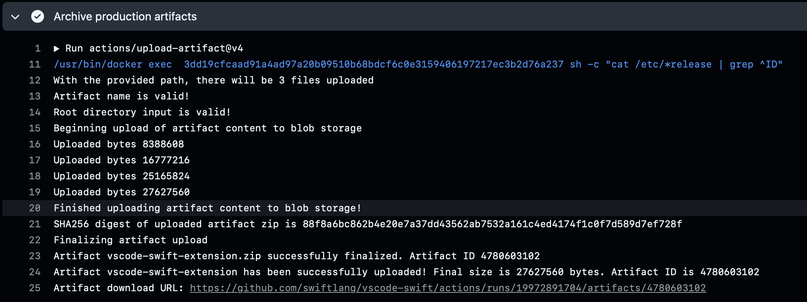
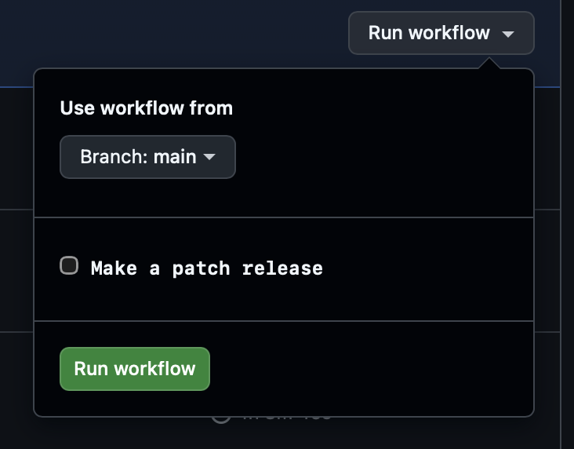

# vscode-swift versioning

Release builds for the extension will always have an even minor version number (e.g. `2.0.2`). Pre-release versions will always be one minor version above the latest release version with a patch version set to the day that the VSIX was built (e.g. `2.1.20250327`). These rules are enforced by CI. This is how VS Code recommends extensions [distinguish the version for pre-releases](https://code.visualstudio.com/api/working-with-extensions/publishing-extension#prerelease-extensions).

The version number in the [package.json](package.json) should always be odd (signifying devlopment/pre-release) and the minor version will be one lower than our next feature release.

For example, if our latest official release on the marketplace is 2.14.1, then the `package.json` version will be `2.15.0-dev`. This will be the version number used when you run the `npm run dev-release` script. During the [nightly build](https://github.com/swiftlang/vscode-swift/actions/workflows/nightly.yml) an official release, and a pre-release VSIX are created, the pre-release VSIX would have version `2.15.<date>` and the release VSIX would have version `2.16.0`, i.e. the next even numbered minor version. These VSIXs can be downloaded using the link provided by the "Archive production artifacts" step:

One day when that `2.16.0` is released, the `package.json` version should be bumped to the next odd numbered minor version, i.e. `2.17.0-dev` in this example.

## Patch Releases

When we occasionally need to put out a quick patch release, manually go to the [nightly build](https://github.com/swiftlang/vscode-swift/actions/workflows/nightly.yml), and `Run workflow` enabling the `Make a patch release` toggle before pressing the `Run workflow` button again:

When running `npm run patch-release`, the script will take `2.15.0` from the `package.json`, decrement 1 minor version (i.e. 2.14 in this example), and determine the next available patch version number that has not been released. So for example, since 2.14.1 is already on the Marketplace in this example, 2.14.2 would be the version used in the VSIX