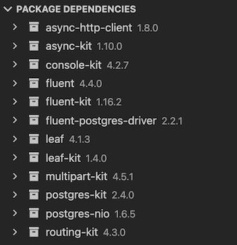
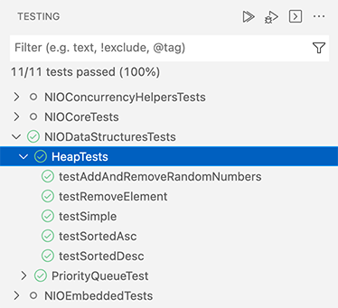

# Swift for Visual Studio Code

This extension adds language support for Swift to Visual Studio Code. It supports:

* Code completion
* Jump to definition, peek definition, find all references, symbol search
* Error annotations and apply suggestions from errors
* Automatic generation of launch configurations for debugging with [CodeLLDB](https://marketplace.visualstudio.com/items?itemName=vadimcn.vscode-lldb)
* Automatic task creation
* Package dependency view
* Test Explorer view

Swift support uses [SourceKit LSP](https://github.com/apple/sourcekit-lsp) for the [language server](https://microsoft.github.io/language-server-protocol/overviews/lsp/overview/) to power code completion and [LLDB](https://github.com/vadimcn/vscode-lldb) to enable debugging.

The aim is to provide a first-class, feature complete extension to make developing Swift applications on all platforms a seamless experience.

If you experience any issues or want to propose new features please [create an issue](https://github.com/swiftlang/vscode-swift/issues/new) or post on the [swift.org forums](https://forums.swift.org) in the [VS Code Swift Extension category](https://forums.swift.org/c/related-projects/vscode-swift-extension/).

## Contributing

The Swift for Visual Studio Code extension is a community driven project originally created by the [Swift Server Working Group](https://www.swift.org/sswg/) and now maintained as part of the [swiftlang organization](https://github.com/swiftlang/). Contributions are appreciated, including code, tests and documentation. For more details see [CONTRIBUTING.md](CONTRIBUTING.md).

To give clarity of what is expected of our members, Swift has adopted the code of conduct defined by the Contributor Covenant. This document is used across many open source communities, and we think it articulates our values well. For more, see the [Code of Conduct](https://swift.org/code-of-conduct/).

## Installation

For the extension to work, you must have Swift installed on your system. Please see the [Getting Started Guide on Swift.org](https://www.swift.org/getting-started/) for details on how to install Swift on your system. Install the extension from [VS Code Marketplace](https://marketplace.visualstudio.com/items?itemName=swiftlang.swift) and open a Swift package! You'll be prompted to install and configure the CodeLLDB extension, which you should do so.

## Features

### Language features

The extension provides language features such as code completion and jump to definition via the Apple project [SourceKit-LSP](https://github.com/apple/sourcekit-lsp). For these to work fully it is required that the project has been built at least once. Every time you add a new dependency to your project you should build it so SourceKit-LSP can extract the symbol data for that dependency.

### Automatic task creation

For workspaces that contain a **Package.swift** file, this extension will create the following tasks:

- **Build All**: Build all targets in the Package
- **Build Debug <Executable>**: Each executable in a Package.swift get a task for building a debug build
- **Build Release <Executable>**: Each executable in a Package.swift get a task for building a release build

These tasks are available via **Terminal ▸ Run Task...** and **Terminal ▸ Run Build Task...**.

### Commands

The extension adds the following commands, available via the command palette.

#### Configuration

- **Create New Project...**: Create a new Swift project using a template. This opens a dialog to guide you through creating a new project structure.
- **Create New Swift File...**: Create a new `.swift` file in the current workspace.
- **Select Toolchain**: Select which locally installed Swift toolchain (including Xcode toolchains on macOS) you want to use Swift tools from.

The following command is only available on macOS

- **Select Target Platform**: This is an experimental command used to get code completion for iOS, tvOS projects

#### Building and Debugging

- **Run Build**: Run `swift build` for the package associated with the open file.
- **Debug Build**: Run `swift build` with debugging enabled for the package associated with the open file, launching the binary and attaching the debugger.
- **Attach to Process...**: Attach the debugger to an already running process for debugging.
- **Clean Build Folder**: Clean the build folder for the package associated with the open file, removing all previously built products.

#### Dependency Management

- **Resolve Package Dependencies**: Run `swift package resolve` on package associated with open file.
- **Update Package Dependencies**: Run `swift package update` on package associated with open file.
- **Reset Package Dependencies**: Run `swift package reset` on package associated with open file.
- **Add to Workspace**: Add the current package to the active workspace in VS Code.
- **Clean Build**: Run `swift package clean` on package associated with open file.
- **Open Package.swift**: Open Package.swift for package associated with open file.
- **Use Local Version**: Switch the package dependency to use a local version of the package instead of the remote repository version.
- **Edit Locally**: Make the package dependency editable locally, allowing changes to the dependency to be reflected immediately.
- **Revert To Original Version**: Revert the package dependency to its original, unedited state after local changes have been made.
- **View Repository**: Open the external repository of the selected Swift package in a browser.

#### Testing

- **Test: Run All Tests**: Run all the tests across all test targes in the open project.
- **Test: Rerun Last Run**: Perform the last test run again.
- **Test: Open Coverage**: Open the last generated coverage report, if one exists.
- **Test: Run All Tests in Parallel**: Run all tests in parallel. This action only affects XCTests. Swift-testing tests are parallel by default, and their parallelism [is controlled in code](https://developer.apple.com/documentation/testing/parallelization).

#### Snippets and Scripts

- **Insert Function Comment**: Insert a standard comment block for documenting a Swift function in the current file.
- **Run Swift Script**: Run the currently open file, as a Swift script. The file must not be part of a build target. If the file has not been saved it will save it to a temporary file so it can be run.
- **Run Swift Snippet**: If the currently open file is a Swift snippet then run it.
- **Debug Swift Snippet**: If the currently open file is a Swift snippet then debug it.

#### Diagnostics

- **Capture VS Code Swift Diagnostic Bundle**: Capture a diagnostic bundle from VS Code, containing logs and information to aid in troubleshooting Swift-related issues.
- **Clear Diagnostics Collection**: Clear all collected diagnostics in the current workspace to start fresh.
- **Restart LSP Server**: Restart the Swift Language Server Protocol (LSP) server for the current workspace.
- **Re-Index Project**: Force a re-index of the project to refresh code completion and symbol navigation support.

### Package dependencies

If your workspace contains a package that has dependencies, this extension will add a **Package Dependencies** view to the Explorer:

Additionally, the extension will monitor **Package.swift** and **Package.resolved** for changes, resolve any changes to the dependencies, and update the view as needed.

### Debugging

The Swift extension uses the [CodeLLDB](https://marketplace.visualstudio.com/items?itemName=vadimcn.vscode-lldb) extension for debugging.

When you open a Swift package (a directory containing a **Package.swift**) the extension creates build tasks and launch configurations for each executable. If the package contains tests, the extension creates a configuration to run the tests. These all use the CodeLLDB extension as a debugger.

Press `F5` to run an executable and start debugging. If you have multiple launch configurations you can choose which launch configuration to use in the debugger view.

CodeLLDB has a version of `lldb` packaged with it and by default this is the version it uses for debugging. However, this version of `lldb` does not work with Swift. Fortunately, CodeLLDB allows you to choose an alternate version. The Swift extension will attempt to ascertain which version is required and give you the option to update the CodeLLDB configuration.

### Test Explorer

If your package contains tests then they can be viewed, run and debugged in the Test Explorer.

Once your project has been built the Test Explorer will be able to list all your tests. These are grouped by package, then test target and finally XCTestCase class. From the Test Explorer you can initiate a test run, debug a test run and if a file has already been opened you can jump to the source for a test.

### Documentation

* [Extension Settings](docs/settings.md)
* [Test Coverage](docs/test-coverage.md)
* [Visual Studio Code Dev Containers](docs/remote-dev.md)
