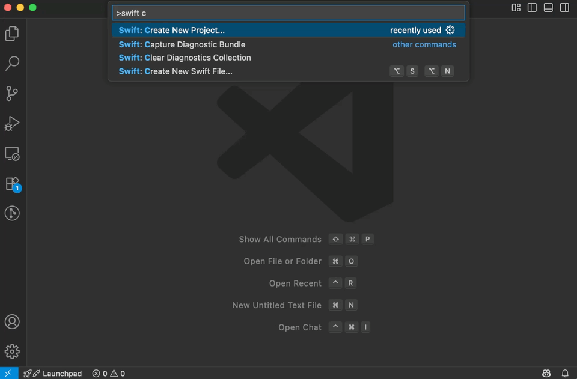
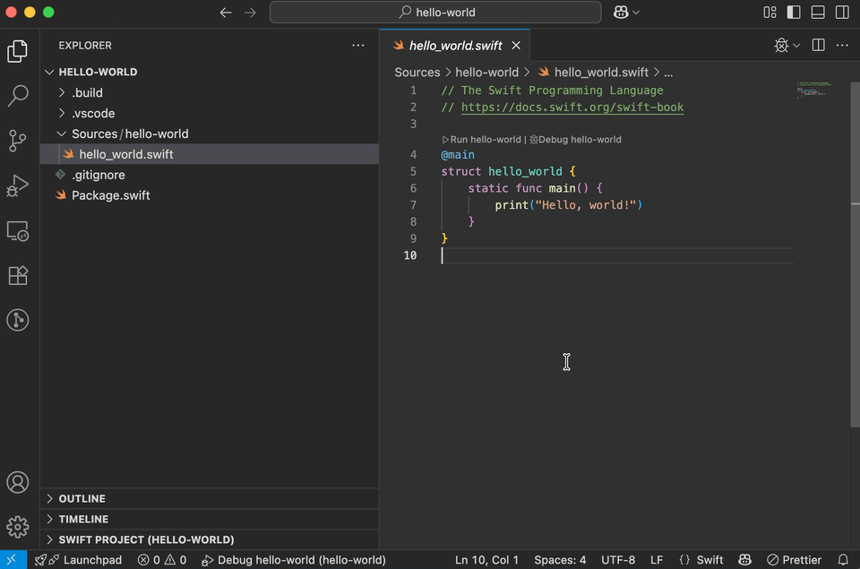
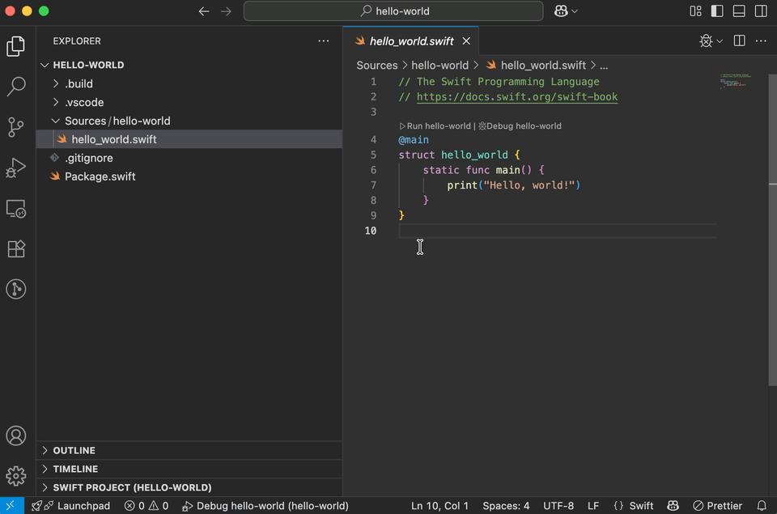

# Swift for Visual Studio Code

This extension adds language support for Swift to Visual Studio Code, providing a seamless experience for developing Swift applications on all supported platforms. It supports features such as:

* Code completion
* Jump to definition, peek definition, find all references and symbol search
* Error annotations and fix suggestions
* Automatic generation of launch configurations for debugging with [LLDB DAP](https://marketplace.visualstudio.com/items?itemName=llvm-vs-code-extensions.lldb-dap)
* Automatic task creation
* A Project Panel to quickly run actions and view dependencies
* Test Explorer view

> **Note**  
> Most features of the Swift for Visual Studio Code extension only work with projects that build with Swift Package Manager. These projects will have a `Package.swift` file in their root folder. Support for Xcode projects (`.xcodeproj`) is limited.

### Creating New Projects


### Building and Running Executables


### Debugging Executables


### Running Tests


# Documentation

The [getting started guide](https://www.swift.org/documentation/articles/getting-started-with-vscode-swift.html) and [official documentation](https://docs.swift.org/vscode/documentation/userdocs) for this extension are available on [swift.org](https://www.swift.org).

This extension uses [SourceKit LSP](https://github.com/apple/sourcekit-lsp) for the [language server](https://microsoft.github.io/language-server-protocol/overviews/lsp/overview/), which powers code completion. It also has a dependency on the [LLDB DAP](https://marketplace.visualstudio.com/items?itemName=llvm-vs-code-extensions.lldb-dap) extension to enable debugging.

To propose new features, you can post on the [swift.org forums](https://forums.swift.org) in the [VS Code Swift Extension category](https://forums.swift.org/c/related-projects/vscode-swift-extension/). If you run into something that doesn't work the way you'd expect, you can [file an issue in the GitHub repository](https://github.com/swiftlang/vscode-swift/issues/new).

## Extension API

The Swift extension exports a comprehensive API that can be used by other Visual Studio Code extensions. The API provides access to:

- **Swift Toolchains**: The active Swift toolchain both globally and on a per-project basis.
- **Swift Projects**: A list of all known Swift projects in the active workspace.
- **SPM Packages**: Swift Package Manager targets, products, dependencies, and plugins.

The API includes a version number that follows [semantic versioning](https://semver.org/) and is separate from the extension's version number. See [the contributing guide](CONTRIBUTING.md) for a more detailed explanation on when this version number is incremented.

### Using the API

To use the API in your extension you can download the [`src/SwiftExtensionApi.ts`](src/SwiftExtensionApi.ts) file from this repository to get proper TypeScript type definitions. It is recommended that you download the version from a tagged release as main is not guaranteed to remain stable.

Example usage:

```typescript
import { getSwiftExtensionApi, SwiftExtensionApi } from './SwiftExtensionApi';

// Get the Swift extension API
const api: SwiftExtensionApi = await getSwiftExtensionApi();

// Access workspace context
const workspaceContext = api.workspaceContext;
if (workspaceContext) {
    // Get the toolchain version
    const toolchain = workspaceContext.globalToolchain;
    console.log(`Using Swift ${toolchain.swiftVersion}`);

    // Listen for folder changes
    workspaceContext.onDidChangeFolders((event) => {
        console.log(`Folder operation: ${event.operation}`);
    });
    
    // Access the in focus folder and its Swift package
    const currentFolder = workspaceContext.currentFolder;
    if (currentFolder) {
        const swiftPackage = currentFolder.swiftPackage;
        const targets = await swiftPackage.targets;
        console.log(`Found ${targets.length} targets`);
    }
}
```

## Contributing

The Swift for Visual Studio Code extension is based on an extension originally created by the [Swift Server Working Group](https://www.swift.org/sswg/). It is now maintained as part of the [swiftlang organization](https://github.com/swiftlang/), and the original extension is deprecated. Contributions, including code, tests, and documentation, are welcome. For more details, refer to [CONTRIBUTING.md](CONTRIBUTING.md).

To provide clarity on the expectations for our members, Swift has adopted the code of conduct outlined in the [Contributor Covenant](https://www.contributor-covenant.org). This widely recognized document effectively encapsulates our values. For more information, please refer to the [Code of Conduct](https://swift.org/code-of-conduct/).
