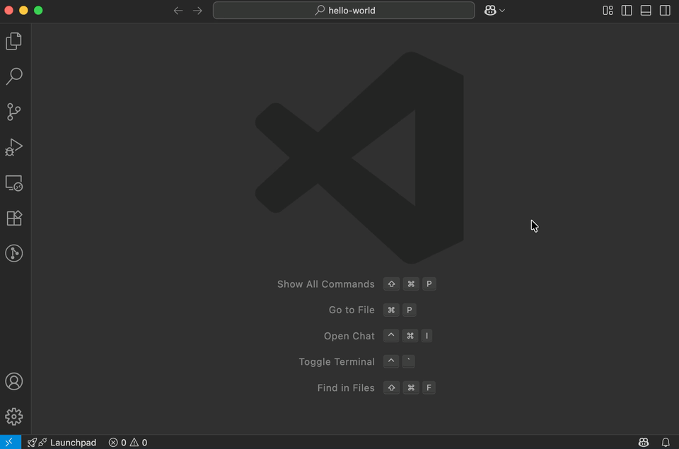
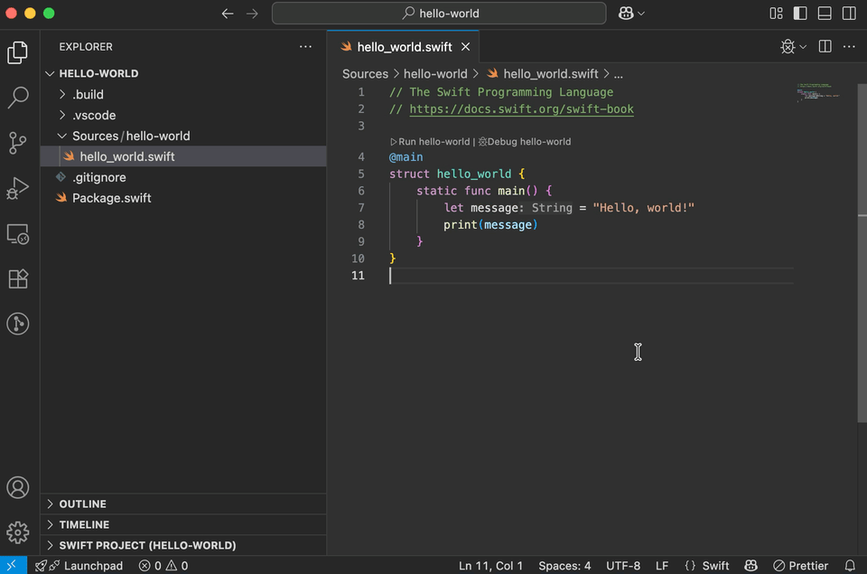

# Swift Extension Settings



The Swift Extension contains several settings you can customize. 

## Workspace Settings

**Add details about custom workspace settings and environment variable here.**

## Inlay Hints

Some language settings such as those for inlay hints for inferred variable types are turned on by default in VS Code.



You can turn off inlay hints for Swift by adding `[swift]` specific settings to your `settings.json` file:

```
   "[swift]": {
        "editor.inlayHints.enabled": "off"
    },
```
