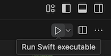

# Run Swift Executables

You can build and run a Swift binary target via the:
1. `Run` or `Debug` CodeLens that appears in the `.swift` file that contains your program's entry point
2. `Project Panel` in the bottom left hand corner of the sidebar under the `Targets` and `Tasks` groups
3. `Tasks` command: You can configure the build tasks through the `launch.json` file in the `.vscode` folder for the project and then select the target you'd like to build with the `Tasks: Run Task` command from the `Command Pallete`
4. `Run Swift executable` editor action in the top right corner of the editor

# Debug Swift Executables

The extension automatically generates the debug and release variants of launch configurations in `launch.json`. You can debug a target by setting a breakpoint and clicking the the `Debug Swift Executable` editor action or through the `Run and Debug` panel in the sidebar.