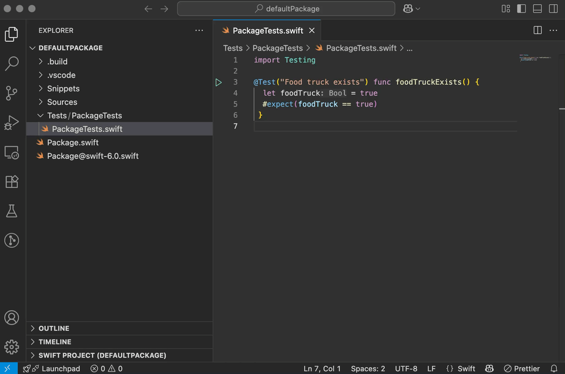

# Run Swift Testing and XCTest Tests

XCTests and Swift Testing tests are detected automatically. You can run them by clicking the ▶ button, with the `Run Test` code lens or through the `Test Explorer` in the sidebar.