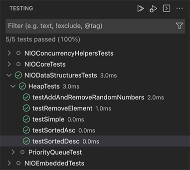

# Test Explorer

vscode-swift shows test results in the test explorer.

If your package contains tests then they can be viewed, run and debugged in the Test Explorer.

Once your project is built, the Test Explorer will list all your tests. These tests are grouped by package, then test target, and finally, by XCTestCase class. From the Test Explorer, you can initiate a test run, debug a test run, and if a file has already been opened, you can jump to the source code for a test.
